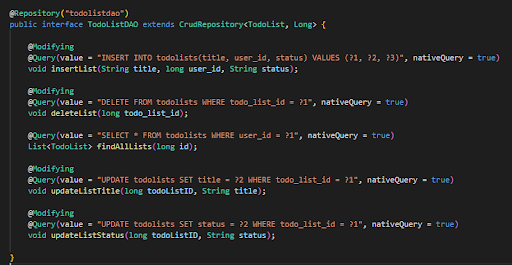

# **San Jose State University**

## **Course:** Enterprise Software - CMPE172 / SPRING 2020

**Instructor:** Professor Babu Thomas <br />
**Team Name:** The IT Crowd - Team 8 <br />
**Team Members:**

- Tien Nguyen
- Sridevi Kuchibotla
- Dale Christian Seen

# Project Introduction

In today’s world, it is very easy to get distracted because of the Internet. Many people end up procrastinating on the things that they should be doing. Agenda is a web-based application, and it seeks to increase the users’ productivity by allowing them to plan and execute their tasks. Users can have multiple to-do lists and can categorize them by name. They can create, edit, check-off, and remove items on a list. Most importantly, Agenda utilizes Amazon Web Services to secure the users’ data.

## Application URL

http://agenda-client-dev.us-west-2.elasticbeanstalk.com/

## Project Setup Prerequisites:

1. NodeJS Runtime Environment
2. Java 11
3. Maven

## How To Run The Program Locally:

### Client

1. Open up a terminal and change directory (`cd`) to the project directory
2. `cd` to 'client'
3. Type `npm install` to install frontend dependencies
4. Type `npm run start` to start client server

### Server

1. `cd` to the project directory.
2. `cd` to server.
3. Build the dependencies of the maven project: `mvn spring-boot:run`
4. Run the main method at server/src/main/java/TodoApplication.java

## Project Documentation

### System Diagram


### Database ERD


### Server Structure


### Database Queries



### Mid-tier API


### Data Transport Example of a TodoList(JSON):

```
{
    "todo_list_id": 41,
    "title": "Homework",
    "user_id": 39,
    "description": "Homework for SJSU",
    "status": "planned"
    "creation_date": "1999-04-18 23:45:37"
    "modification_date": "2000-04-18 23:45:37"
}
```

## Project Documents (Google Docs):

- [Project Report](https://docs.google.com/document/d/1Uxd7TTeCD-0PiNiAxDvdvqvcGygJw6UGnfWWuA8b8IU/edit?usp=sharing)
- [Project Proposal](https://docs.google.com/document/d/1qxvki3F0zz8bxmlaqNY0W6UA-gU2xafN5GrrWD1lQOs/edit?usp=sharing)
- [Database ERD](https://drive.google.com/file/d/1YBNmNB-DwWwcsTWDBla1Nk2MjC2HV14G/view?usp=sharing)
- [Project Backlog](https://docs.google.com/spreadsheets/d/1xL222FVPeo5MLKAXXRyjO8meQvX-7i1IBg-ogQp9kgw/edit?usp=sharing)
